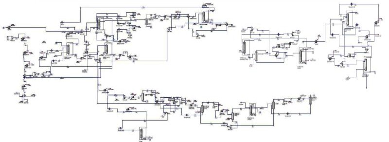

### BASc. Chemical Engineering (2007-2011)

[**University of Tehran**](https://ut.ac.ir/en), Tehran, Iran, 2007: Sept. - 2011: Sept.

**Project**

Simulation and cost evaluation of hot section of BIPC olefin plant, with [**Dr. Nasim Tahouni**](https://scholar.google.com/citations?user=jWEhjFcAAAAJ&hl=en).

**Project Summary**

Used **Aspen Hysys** and **Aspen Plus** to evaluate **retrofitting** of industrial scale **petroleum refinery** complex by producing process flow diagram (**PFD**), piping/process & instrumentation diagram (**P&ID**), **cost** and **utility**, pinch and exergy.

**Tasks Performed**

- Simulated existing and proposed **process configurations using Aspen HYSYS and Aspen Plus**, focusing on optimizing reactor and separation systems for olefin recovery.
- Developed and **documented detailed Process Flow Diagrams (PFDs) and Piping & Instrumentation Diagrams (P&IDs)** to map unit operations, control loops, and equipment connectivity.
- Performed **equipment sizing and specification** for heat exchangers, reactors, compressors, and distillation columns based on simulated operating conditions.
- Conducted **cost estimation and utility analysis** (CAPEX and OPEX) to support retrofitting and procurement decisions.
- Applied **pinch analysis and exergy analysis** to evaluate and enhance energy integration and thermodynamic efficiency across the system.
- Assessed **retrofitting feasibility** by integrating performance data, economic viability, and process safety considerations.

