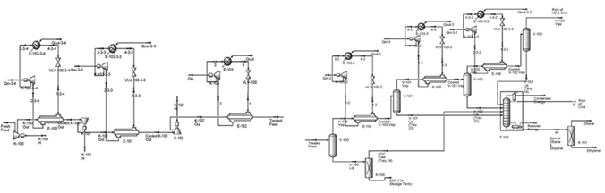

### Chemical Engineering Intern (2011: July - Aug.)

[**Research Institute of Petroleum Industry (RIPI)**](https://www.ripi.ir/en), Iran.

**Project**

Design of Separation Systems for Ethane and Methane, with [**Dr. Nasim Tahouni**](https://scholar.google.com/citations?user=jWEhjFcAAAAJ&hl=en).

**Project Summary**

Completed a process engineering internship focused on the **simulation and optimization** of a gas separation unit targeting high-purity ethane and methane recovery, integrating both **technical design** and **economic analysis** using **industry-standard tools**.

**Tasks Performed**

- **Designed**, **simulated**, and **optimized** a separation process in **Aspen HYSYS**, achieving efficient separation of ethane and methane under various operating conditions.
- Developed comprehensive **Process Flow Diagrams (PFDs)** to visualize and document the system configuration, **material and energy balances**, and process controls.
- Performed **equipment sizing and selection** for distillation columns, heat exchangers, compressors, and separators based on simulated process data and vendor specifications.
- Conducted **cost analysis**, including **capital expenditure (CAPEX)**, **operating expenditure (OPEX)**, and utility consumption, to assess **economic feasibility** and guide procurement strategies.
- Applied **exergy analysis** and **pinch analysis** to identify thermodynamic inefficiencies and optimize energy integration, improving process sustainability and reducing waste heat.
- Evaluated and compared **equipment procurement options** using **technical and economic criteria** to support decision-making for **pilot-scale implementation**.

