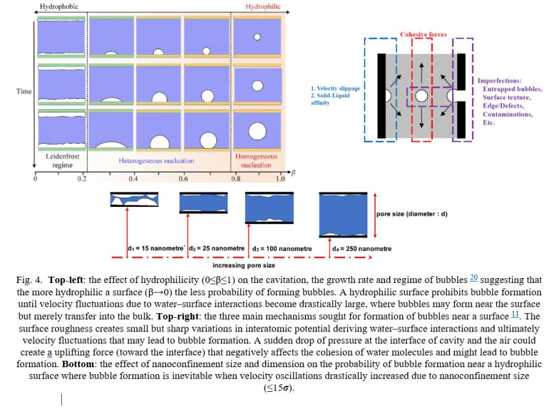

### Chemical Engineer (2022 May - 2022 Dec.)

[**Chemical and Biological Engineering Department**](https://chbe.ubc.ca/), [**University of British Columbia (UBC)**](https://www.ubc.ca/), Vancouver, Canada.

**Project**     
Nanocavitation and its Mitigation in Fabricating Artificial Trees, with [**Dr. Simcha Srebnik**](https://scholar.google.com/citations?user=--v31HgAAAAJ&hl=en).         

**Project Goal**       
Investigated nanoscale water flow mechanisms to reduce **nanobubble formation** and ensure stable, uninterrupted transport in **nanoporous channels**—critical for enhancing efficiency in advanced **evaporative cooling systems**.  

**Tasks Performed**     
- Conducted an in-depth literature review to establish **design principles** for self-driven water transport at the nanoscale.                     
- Developed algorithms to quantitatively assess the impact of **surface hydrophilicity on nanobubble** nucleation and stability.                
- Created **custom computational routines** for high-throughput molecular dynamics (MD) simulations using **LAMMPS**, tailored for complex **fluid-surface interactions**.                        
- Compiled and optimized LAMMPS on UBC's Sockeye HPC environment for scalable, in-house simulation workflows.                     
- Extended LAMMPS functionality with **custom C++ modules** to meet unique research needs in nanoscale flow modeling.                       
- Implemented post-processing scripts in **Python** for automated extraction and visualization of simulation results, including pressure profiles, density distributions, and flow characteristics.                  
- Collaborated with a **multidisciplinary team** to validate simulation results against theoretical models and experimental data, enhancing cross-domain communication and interpretation.    

