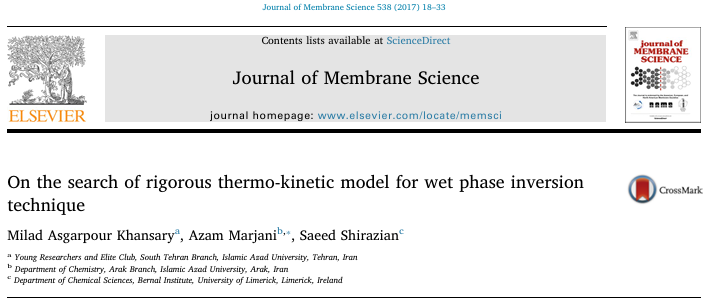

### Thermokinetic Model of Phase Inversion

In the paper [**On the search of rigorous thermo-kinetic model for wet phase inversion technique**](https://www.sciencedirect.com/science/article/pii/S0376738817306889), we developed a rigorous **thermo-kinetic model for the wet phase inversion process**, with special emphasis on the role of the **diffusion-thermo effect** at the interface.

- Download the **MATLAB** script [**here**](Publications_20170501_JMS.zip).

