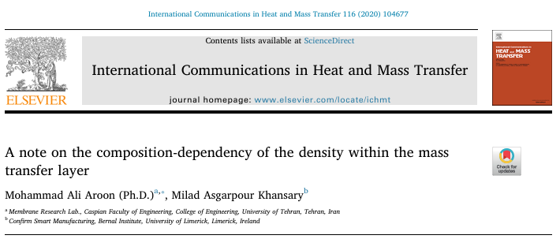

### Variable Density Mass Transfer Correction R<sub>n</sub>

In the paper [**A note on the composition-dependency of the density within the mass transfer layer**](https://www.sciencedirect.com/science/article/pii/S0735193320302050), we derived the equation for the **mass transfer correction factor R<sub>n</sub>**, which accounts for the effect of **varying density (ρ) in a binary mixture**. The model is particularly relevant for **high-flux gas absorption or evaporation** where the standard **constant-density assumptions** fail. 



**Usage Instructions**  

- Save the script as `script_name.py` and run it from the terminal as: **`python script_name.py`**

#### **R<sub>n</sub> as β and ρ<sub>12</sub> vary**

```bash
import numpy as np
omg1=np.linspace(0.00001, 0.99999, 25)
betta=[-1, -0.75, -0.5, -0.25, 0, 0.25, 0.5, 0.75, 1]
for BETTA in betta:
    for OMG1 in omg1:
        RHO12 = 1/(1 - BETTA * OMG1)
        Rn=1 + (1/RHO12 - 1) * (1/np.log(1/(1 - OMG1)) - (1 - OMG1)/OMG1)
        print (BETTA, RHO12, Rn)
```

#### **R<sub>n</sub> as β and ω<sub>1</sub> vary**

```bash
import numpy as np
omg1=np.linspace(0.00001, 0.99999, 25)
betta=[-1, -0.75, -0.5, -0.25, 0, 0.25, 0.5, 0.75, 1]
for BETTA in betta:
    for OMG1 in omg1:
        RHO12 = 1/(1 - BETTA * OMG1)
        Rn=1 + (1/RHO12 - 1) * (1/np.log(1/(1 - OMG1)) - (1 - OMG1)/OMG1)
        print (BETTA, OMG1, Rn)
```

#### **R<sub>n</sub> as ρ<sub>12</sub> and ω<sub>1</sub> vary**

```bash
import numpy as np
omg1=np.linspace(0.00001, 0.99999, 25)
rho12=[0.001, 0.01, 0.1, 0.25, 0.5, 0.75, 1, 1.5, 2, 5, 10]
for RHO12 in rho12:
    for OMG1 in omg1:
        Rn=1 + (1/RHO12 - 1) * (1/np.log(1/(1 - OMG1)) - (1 - OMG1)/OMG1)
        print (RHO12, OMG1, Rn)   
```